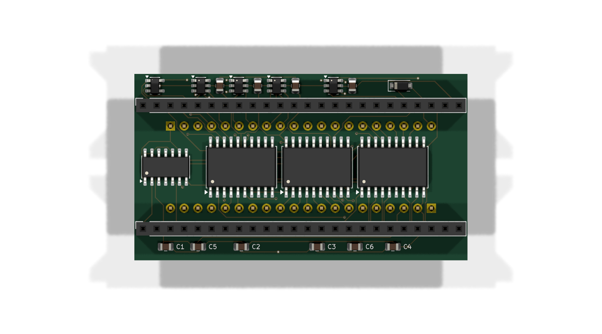
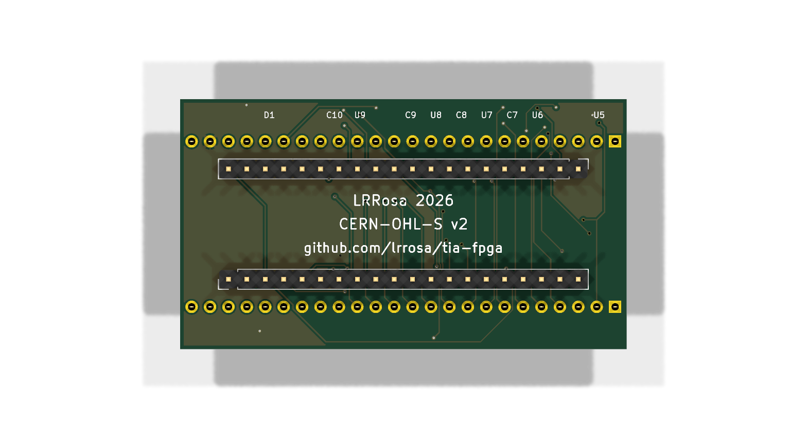

# tia-fpga

An FPGA replacement for the **Television Interface Adaptor (TIA)** — the custom
`C010444` / `C010444D` (NTSC) video and sound chip of the Atari 2600.

Revision **B** is the digital interface board between a Sipeed Tang Nano 9K
module and the TIA's DIP-40 socket, for use with a real 6507 (on a breadboard or
in an actual 2600). Revision A, the first study, was never built.

| Front | Back |
|:---:|:---:|
|  |  |
| Tang Nano sockets face **up**; the logic sits in the channel between the rows | The TIA's DIP-40 pins face **down** into the socket, over the ground pour |

61.6 × 34.54 mm, two layers. Every row lands on the 2.54 mm grid — the
DIP-40's 15.24 mm and the Tang Nano's 22.86 mm — and the board is a little
shorter than the module it carries, as it has to be: in a real 2600 the TIA,
the 6507 and the RIOT sit millimetres apart.

---

## Why this exists

The TIA has **6,193 transistors** — 1,657 of which are NMOS pull-ups, leaving
about 4,500 of actual logic. It fits in any modern FPGA with room to spare:
synthesising a known implementation yields **311 flip-flops** and roughly 2,200
basic gates.

Size was never the problem. Two other things are:

1. **The analogue boundary.** The chroma generator is an analogue delay line
   trimmed by an external 500 kΩ potentiometer (pin 10, `DEL`). It has no direct
   digital equivalent.
2. **5 volts.** No FPGA with enough capacity is 5 V tolerant. And the TIA
   generates the 6507's Φ0 clock, which requires
   V<sub>IH</sub> = V<sub>cc</sub> − 0.2 V ≈ **4.8 V** — not a TTL level. A 3.3 V
   output will not clock the 6507 reliably, and the failure mode is nasty: it
   works intermittently, or works cold and quits once warm.

This revision solves (2) and leaves (1) for later.

## What is on the board

| Ref | Part | Function |
|-----|------|----------|
| J1, J4 | 1x24 sockets | Sipeed Tang Nano 9K module (GW1NR-LV9QN88PC6/I5): J1 takes its **J6** row, J4 its **J5** |
| J2, J3 | 1x20 SIP strips | Plug into the DIP-40 socket in place of the C010444 |
| D1 | MBR0540 | Feeds the module's 5 V pin from the socket, and blocks its USB from feeding the console |
| **U1** | **74AHCT125** | **Φ0 and RDY buffer, powered from +5 V.** The critical part |
| U2 | 74LVC245A | D0–D7 bidirectional bus. A side = FPGA, B side = TIA |
| U3 | 74LVC541A | A0–A5 and R/W into the FPGA; Φ2 buffered to a spare pad |
| U4 | 74LVC541A | /CS0, /CS3, triggers I4/I5 and the 3.579545 MHz crystal clock |
| U5 | 74LVC1G32 | `/CS0 OR /CS3`: `/OE` for the 245, and the FPGA's chip select |
| U6–U9 | 74LVC2G07 | Open-drain drivers for SYNC, LUM0–2, COL, BLK, AUD0 and AUD1 |

The video and sound pads — SYNC, LUM0–2, COL, BLK, AUD0 and AUD1 — each go
through one channel of U6–U9. On the die every one of them is a pull-down
transistor and nothing more; the buffers make the board's pins the same, open
drain and 5 V tolerant, so the console's own pull-ups set every level. See
*Pads and levels* below.

Pin 10 (`DEL`) is marked no-connect: it is the colour trim pot, which has no
function in a replacement.

Neither of the 245's control lines comes from the FPGA. The A side faces the
FPGA, so `DIR` can be driven straight from the buffered R/W (`DIR`=1, a read,
sends FPGA → TIA), and `/OE` comes from U5. That is deliberate — see the pin
budget below.

## The pin budget, and why it constrains everything

The Tang Nano 9K's headers are 2×24, but **only 29 of those 48 pins are usable
3.3 V GPIO**:

| | Count | |
|---|---|---|
| J5 pins 1–22 | 22 | banks 1/2 at 3.3 V — all usable |
| J6 pins 1, 10, 11, 19–22 | 7 | 3.3 V — usable |
| J6 pins 2–9 | 8 | **BANK3 at 1.8 V — not usable at 3.3 V** |
| J5 23–24, J6 12–17 | 8 | HDMI differential pairs — not GPIO |
| J6 18, 23, 24 | 3 | +5V (fed through D1), GND, +3V3 |

Verified against both revisions of the official Sipeed board schematic (3672 and
3674), which agree exactly. Many of the 29 are shared with onboard peripherals
(SD card, RGB LCD, SPI LCD); they are free to reuse as long as you do not fit
those.

**Rev B uses all 29 with nothing spare.** A fully featured TIA needs about 36.
`BLK` has its pin because the FPGA reads `/CS0 OR /CS3` from U5, which makes it
for the 245 anyway, instead of taking the two selects separately.

**Chroma is fitted.** `F_COL` took the pin that used to carry Φ2, and that trade
is deliberate rather than grudging: the FPGA generates Φ0 itself, so it knows
where it is in the bus cycle and can time accesses off its own clock instead of
the 6507's output. It costs a little timing fidelity and buys back colour on the
composite and RF path — which is the difference between a board that only works
with an HDMI monitor and one that revives a console with a dead TIA while
keeping its original video. Φ2 is still buffered by U3, brought out to an
unconnected pad for a future revision.

What still does not fit: the four paddle inputs plus their dump/compare control.

Two ways to get the remaining pins back:

1. **Recover J6/2–9** (8 pins) with a local 1.8 V LDO and a fourth buffer powered
   at 1.8 V. LVC parts run down to 1.65 V and their inputs stay 5 V tolerant, so
   this works — it just adds a rail. This is the cheapest way to the paddles.
2. **Drop the module and put a bare FPGA on the board.** A part in a TQFP-100
   gives ~78 I/O against the module's 29, which ends the pin shortage outright,
   removes U5, brings Φ2 back and makes the paddles possible — and collapses a
   ~20 mm tall stack into a 1 mm chip, which matters if this has to live inside
   a closed console. It costs fine-pitch soldering and your own configuration
   and power plumbing. See `docs/bare-fpga.md`.

This is the single most important thing to know before ordering parts: the Tang
Nano 9K is big enough in *logic* by a wide margin, and tight in *pins*. Every
compromise in this design traces back to that.

## The board

Rev B is a 2-layer, **61.6 × 34.54 mm** board — shorter than the Tang Nano it
carries. In a real 2600 the TIA, the 6507 and the RIOT sit millimetres apart,
ringed by resistor networks and the cartridge slot, so the board cannot spread
sideways. The two sets of rows face opposite ways:

| y (mm) | Row | Side | Faces |
|---|---|---|---|
| 5.84 | J1 — Tang Nano **J6** | F.Cu | socket, **up** |
| 9.65 | J2 — TIA pins 1–20 | **B.Cu** | pins, **down** into the socket |
| 24.89 | J3 — TIA pins 21–40 | **B.Cu** | pins, **down** |
| 28.70 | J4 — Tang Nano **J5** | F.Cu | socket, **up** |

Both pitches land on the 2.54 mm grid: the DIP-40 rows 15.24 mm apart, the Tang
Nano's 22.86 mm, and the DIP pair centred between the sockets — 3.81 mm of gap
on each side. Which socket takes which module row is not free — see
[Which row is which](#which-row-is-which). SMD logic sits on the front in the
15.24 mm channel between the DIP rows. The open-drain drivers and their
capacitors sit in the top margin, right above the TIA pins they drive, with D1
beside them, and the channel's decoupling in the bottom margin.

| | |
|---|---|
| Size | 61.6 × 34.54 mm, 2 layers |
| Components | 24 — SOIC/SOT-23 logic, 0805 capacitors, one diode, through-hole connectors |
| Routing | 534 segments, 39 vias, 1.48 m of copper |
| Ground | B.Cu pour, 759 mm² in two islands, tied together by track |
| Track / clearance | 0.18 mm / 0.13 mm |
| **DRC** | **0 violations, 0 unconnected pads** |

### Pin assignment is solved, not listed

Which signal sits on which header position is free — any GPIO can carry any
signal — so it is chosen to put each FPGA pin as close as it can be to the pad
its net really reaches: the buffer or gate between it and the TIA socket, not
the socket pin beyond it. Solved as an assignment problem (Hungarian, over the
29 usable positions, Manhattan distance to those pads), the whole set comes to
571 mm. `F_OSC` is held to J6/1, the right PLL's own input, which costs 25.6 mm
of that and keeps the colour clock off the FPGA's general routing.

The sum is what the module's own geometry allows: J5 carries 22 of the 29
signals and sits on the row *away* from the TIA's pins 1–20, so most of the bus
crosses the channel whatever the assignment does. Solving it still beats the
alternative — the same signals laid out by hand come to 685 mm.

Rev A measured the distance to the TIA pin itself, which left out the detour
through the buffers: its data and chip-select lines crossed the board twice.
The buffers stay ordered left to right by the centroid of what they carry,
**U1, U4, U3, U2**, and against rev A the board saves copper while gaining five
parts:

| | rev A | rev B |
|---|---|---|
| Segments | 601 | **534** |
| Vias | 31 | **39** |
| Copper | 1.68 m | **1.48 m** |

`fpga/tia_fpga.cst` carries the result. Do not reshuffle those `IO_LOC` lines
casually — the layout depends on them.

Autorouted with [Freerouting](https://github.com/freerouting/freerouting) 2.2.4:
all 120 nets in about 12 s but three ground connections. Two are closed with a
via dropped on the branch's own track where it passes over the pour, and the
last two capacitors are tied to their neighbours along the free lane that runs
just inside the top edge. The channel leaves only ~1.1 mm between the header pads and the SOIC
pads, so the geometry decides whether it routes at all: it takes 0.13 mm
clearance and 0.18 mm track. The ground pour is added **after** routing —
Freerouting reads a pour as an obstacle and goes effectively single-layer if one
is present.

Files: `tia-fpga.kicad_pcb`, renders in `docs/`, fabrication output in `gerbers/`.

### Ordering a board

The files in `gerbers/` are ready for any PCB house as they are — Gerber X2
plus Excellon drill, with `FABRICATION-NOTES.txt` alongside them; zip them with
the files at the root of the archive. Nothing in it needs more than standard
low-cost capability:

| | |
|---|---|
| Size / layers | 61.6 × 34.54 mm, 2 layers, 1.6 mm FR4 |
| Min track / clearance | 0.18 mm / 0.13 mm |
| Drills | 0.30 mm (vias), 1.00 mm (connectors) |

`docs/bom-production.csv` is the parts list with suggested orderable numbers.
Three assembly points that are easy to get wrong:

- **J2/J3 mount on the BACK, pins facing DOWN**, and want **round machined
  pins** — square header pins damage a DIP socket.
- **U5–U9, C7–C10 and D1 carry their designators on the back silkscreen**,
  right behind each part: the top margin has no room for them on the front.
- **The module goes in component side up, USB-C end to the left** — see below.
- **The back silkscreen carries the licence notice** — `CERN-OHL-S v2`,
  `LRRosa 2026` and `github.com/lrrosa/tia-fpga`, between the two rows of TIA
  pins. The licence asks for it to travel with the board; keep it on a respin.

### Which row is which

The Tang Nano's two rows are **22.86 mm** apart (9 × 2.54), from Sipeed's own
dimension drawing, `Tang_Nano_9K_3672_size`. Pin 1 of both rows is at the USB-C
end, 2.55 mm from that edge; the HDMI connector is at the other end and
overhangs this board by about 7.5 mm, with a millimetre of module sticking out
at the USB end as well. Both hang in free air, 20 mm above the console.

Looking down at the module with the USB-C end on the left, **J6 is the upper
row and J5 the lower one**, so J1 takes J6 and J4 takes J5. Three things say so
and agree: the pin numbers silkscreened on the module's underside, the QN88's
own pin order on the top-side photo in Sipeed's datasheet, and third-party
carrier boards for the module. On your own board, look for **63** beside pin 1
of one row and **38** beside pin 1 of the other: 63 is J6/1, which this board
wires to `F_OSC`.

Rev A and the first cut of rev B had both of these wrong — 20.32 mm, and the
rows the other way round. Nothing was ever fabricated from them.

The DIP-40 row spacing (15.24 mm) is fixed by the package and is not a guess.

**The board needs tall pins.** It overhangs the neighbouring 6507 and RIOT, which
sit proud of the 2600's PCB in their own sockets. Standard DIP header pins would
put this board straight into them; a socket extender or long machined pins are
required. Measure the vertical clearance in your console — the Tang Nano's HDMI
connector adds roughly 5 mm on top.

**There are no mounting holes.** The board is held by its own pins in the TIA
socket, and there is nothing to screw into inside a 2600. Adding holes only
forced the board larger, so they were dropped.

### Known limitations

- The four paddle inputs still do not fit — see the pin budget above.
- No ground pour on F.Cu; only B.Cu is poured.

### Pads and levels

Reading the die's netlist for the RTL settled something the schematic had
assumed. **Every video and sound pad on the TIA — SYNC, LUM0–2, COL, AUD0,
AUD1, and BLK and RDY too — is a pull-down transistor and nothing else.** None
of them can drive high. Φ0 is the only output with a real driver on both
sides.

The console schematics show the other half:

| | 2600A, rev 16 | 2600 (the original board) |
|---|---|---|
| LUM0–2, SYNC | R218–R221, 3.3–4.7 kΩ to +5 V, straight into the summing resistors (R214–R217: 27, 47, 110, 24 kΩ) | R218–R221, 3.3 kΩ to +5 V, into a CD4050 run from a divider off +5 V (R231, R232: about 3.6 V), then the summing resistors (R222–R224, R234: 12, 24, 47, 10 kΩ) |
| COL | R228, 1 kΩ to +5 V; C210, 47 pF, to a second 1 kΩ pull-up (R211); 6.8 kΩ and 22 pF into the sum | R212, 1 kΩ to +5 V; C212, 47 pF, to a second 1 kΩ pull-up (R214); 22 pF and 6.8 kΩ into the sum |
| BLK | R234, 820 Ω, into the COL node (revs 14 and 15: not connected) | R213, 680 Ω, into the COL node |
| AUD0, AUD1 | joined; R206, 1 kΩ to +5 V; 0.1 µF and 18 kΩ into the sound oscillator | joined; R208, 1 kΩ to +5 V; the same coupling |

PAL consoles use a different TIA (C011903): one sound pad, AUD on pin 13 with
its own 1 kΩ pull-up, while pins 12 and 8 carry the PAL signals. This board is
for the NTSC chip.

Rev B follows the die:

- **Open drain, 5 V tolerant.** Each of those pads goes through one channel of
  a 74LVC2G07 (U6–U9) powered at 3.3 V. The FPGA drives the channel's input:
  0 pulls the socket pin low, 1 lets it go, and the console's pull-up takes the
  line wherever it took the TIA's — 5 V on a 2600A's luma lines, the CD4050's
  input on an original 2600, the colour and sound nodes through their 1 kΩ.
  Nothing on the socket side reaches the FPGA's pins.
- **BLK is driven.** It pulls low through the whole blanking interval. On the
  original 2600 (through 680 Ω) and the 2600A from rev 16 (820 Ω) it drags the
  colour node down with it: against the 1 kΩ pull-up that node only reaches
  about 2 V while blanking, so the burst — the only colour sent then — gets
  well under half the swing of the picture's colour, and a TV sets its colour
  gain by the burst. On revs 14 and 15 of the 2600A the pin is not connected,
  and nothing changes.
- **The two sound pins are joined** by a trace on an unmodified 2600, which
  open drain makes harmless either way. By default `tia_board.v` still puts
  the same pulse-width mix of both channels on both pins; for a console
  modified for stereo, `AUDIO_STEREO = 1` gives each pin its own channel, in
  non-overlapping halves of the pulse frame so the two still add correctly
  wherever they meet.
- **No video network on the board.** Rev A carried a copy of the console's
  resistor network, for use outside a console. With open-drain pads it would
  have needed all of it — pull-ups, summing resistors, the colour coupling and
  BLK's resistor — so rev B leaves it off. To take video from the socket pins
  on a breadboard, build the 2600A rev 16 column of the table above.

## Two ways to use this

**Reviving a dead console.** Pull the failed TIA, drop this in its socket, and
keep the 2600's own RF modulator or composite mod. Chroma, luma, sync and audio
come out on the same socket pins the original chip used, open drain as the
chip's are, so the console's video path is untouched.

**As a development target.** Plug it into a breadboard next to a real 6507.
The Tang Nano's HDMI connector would cost no header pins — its pins are
dedicated differential pairs on the module — but the RTL has no TMDS encoder
yet, so for now the picture comes from the socket pins, through a network like
the console's.

## The RTL

`rtl/` holds the core: horizontal counter, playfield, two players, two
missiles, ball, collisions, HMOVE, audio and the bus interface, in eleven files
of plain Verilog-2005, plus `tia_board.v`, which puts it on this board. `sim/`
holds the test harness the section below argues for, and it is not
aspirational: the core is checked against
[Sim2600](https://github.com/gregjames/Sim2600) half clock by half clock, on a
real game and on test cartridges written to hit each feature from every phase
that matters.

```bash
python sim/run.py
```

Against Donkey Kong from power-on to its first picture, and against every test
cartridge -- playfield, players, missiles, ball, collisions, HMOVE with Cosmic
Ark, resets at every phase of HBLANK, vertical delay and both sound cartridges
-- the core matches the die on every pin at every half clock.
[`sim/README.md`](sim/README.md) has the table. (The Donkey Kong traces are regenerated locally rather
than committed, since they carry the game's artwork.)

**Sim2600 wires one clock wrong, and both wirings are now in the suite.**
Upstream Sim2600 feeds the TIA's Φ2 input from the 6507's Φ1 output, the
inverse of what the console does. The die only looks at that pin through
write strobes, so everything still worked, but every write landed on the other
half of the colour clock from where a real console puts it. With the console's
wiring (`sim/patches/sim2600-phi2.patch`, traces in `sim/traces/phi2/`), five
of the core's timing rules turned out to have been fitted to the wrong side
and were re-read from the netlist — RSYNC's restart, RDY's release, how
long a reset holds an object's clock, the size gate of stretched players and
when HMOVE's comparators see a new value. The last mismatch was a mechanism
no rule had covered: HMOVE pulses in the visible line merge into the object
clocks and show on the pads half a colour clock early. The core now matches
both sets on every pin of every trace.

**The board.** `rtl/tia_board.v` is everything between the core and the board's
pins: the core's clock from a PLL locked to the console's crystal, Φ2 rebuilt
from the Φ0 the board makes itself, the data bus, chroma as that clock shifted
in phase by hue, and sound as pulse width. `fpga/tia_fpga_top.v` adds the Gowin
PLL, bus buffers and chroma ODDR. `sim/tb_board.v` replays the console-wired
traces into the board logic and checks every pin it drives, and
`fpga/build_gowin.tcl` builds the bitstream with Gowin EDA — from a directory
whose path has no spaces, since Gowin's place and route will not run in one
that does.

Getting there turned up a good deal the published documentation does not say,
all of it now in the source: which edge of the colour clock each latch runs on;
that Φ0 is a 50 per cent square wave reloaded by the horizontal counter; what
RSYNC actually does, which Towers left as "requires more investigation"; that
HMOVE's first compare must come before its first decrement, or an HMxx of -8
moves an object sixteen pixels the wrong way; that HMOVE's pulses past HBLANK
merge into the object clocks instead of counting; and exactly when a mid-line playfield
write reaches the screen. Once the harness could record the die's internal
wires as well as its pins, the netlist itself settled the rest: how a RESxx
strobe really resets an object -- by holding its clock, not by zeroing its
counter -- and how the sound counters are clocked, down to the discovery that
the two audio channels are not wired alike.

**Clocking.** The real chip is clocked by the 3.58 MHz colour clock and uses
both its edges. This core takes a faster system clock and treats the colour
clock as a signal to oversample, so everything is one clock domain, one edge,
no gated clocks. On this board `clk0` comes from the console's own crystal
through U4 and the system clock from a PLL, so the core stays locked to the
machine it is plugged into.

## Status

- [x] Rev B schematic — passes KiCad 10 ERC with 0 violations
- [x] FPGA pin assignment (`fpga/tia_fpga.cst`)
- [x] PCB layout — rev B routed, ground pour, DRC clean (0 violations, 0
      unconnected pads)
- [x] Open-drain video and sound pads and `BLK` on pin 6 — U6–U9, with
      `sim/tb_board.v` checking `BLK` against the die
- [x] Sim2600 test harness — traces, replay testbench, test cartridges
- [x] TIA RTL — matches the die on a real game and on every test cartridge
- [x] Audio -- read off the die's netlist; both channels match on every trace
- [x] Object resets, scan clock, widths and HMOVE timing -- read off the netlist
- [x] Board wrapper — `rtl/tia_board.v` and `fpga/tia_fpga_top.v`: PLL off the
      console's crystal, Φ2 rebuilt from Φ0, data bus tri-state, chroma through
      an ODDR, sound as pulse width. Checked pin by pin against the traces by
      `sim/tb_board.v`
- [x] Traces with the console's wiring of Φ2 — Sim2600 feeds the TIA the
      6507's Φ1; `sim/patches/sim2600-phi2.patch` fixes that and
      `sim/traces/phi2/` holds the re-recorded set
- [x] Synthesis check: Yosys `synth_gowin` with no warnings — the core is
      514 flip-flops and 740 LUTs, the whole board top 622 and 705, under
      10 per cent of the GW1NR-9 (`fpga/check_synth.py`)
- [x] Gowin EDA build (V1.9.11.03 Education): bitstream, no setup or hold
      violations at the slow corner, 60.4 MHz Fmax against the 57.27 MHz
      clock (`fpga/build_gowin.tcl`)
- [x] Stretched players reset mid-copy, Cosmic Ark and HMOVE pulses in the
      visible line, with the console's wiring — every trace matches
- [ ] Paddle circuit (still needs pins, see above)
- [x] Composite video path wired — the chroma pin is fitted and `tia_board.v`
      synthesises the 15 subcarrier phases, as the colour clock shifted in
      phase by hue through an ODDR (`HUE_TURN`). Never yet seen on a television
- [x] Tang Nano interface checked against Sipeed's own dimension drawing: rows
      22.86 mm apart, J6 on J1, and the module fed from the socket through D1
- [x] Boot time — the bitstream loads at 31.25 MHz (`-loading_rate 250/8` in
      `fpga/build_gowin.tcl`), about 8 ms, against the 17–58 ms the console
      takes to release the 6507's reset. Still to be measured on hardware

## Opening the project

Requires **KiCad 10**. Only stock libraries are used — there are no custom
symbols or footprints to install.

```bash
kicad tia-fpga.kicad_pro
```

To run ERC from the command line:

```bash
kicad-cli sch erc tia-fpga.kicad_sch -o erc.rpt --severity-error --severity-warning
```

## Suggested order of work

1. ~~**Build the test harness first.**~~ Done -- `sim/`. Comparing half clock
   by half clock against [Sim2600](https://github.com/gregjames/Sim2600) -- not
   an emulator, but the netlist extracted from the die shot, simulated
   transistor by transistor -- earned its keep at once. Most of what it caught
   were things the documentation states plainly enough that they looked
   settled, and none of them would have been findable by looking at a picture.
2. ~~**Rewrite the TIA one block at a time**~~ -- done, in dependency order:
   horizontal sync counter, playfield, players, missiles and ball, collisions,
   HMOVE. HMOVE really is the most treacherous; leave it last.
3. ~~**Widen the coverage.**~~ Done: the test cartridges in `sim/roms/` cover
   every CTRLPF, NUSIZ, HMOVE and AUDC value, and resets at every phase of
   HBLANK, and the core matches the die on all of them.
4. ~~**Board wrapper and synthesis**~~ -- done: `rtl/tia_board.v`,
   `fpga/tia_fpga_top.v`, `fpga/tia_fpga.sdc`, `fpga/build_gowin.tcl`.
5. **Run it on the Tang Nano alone** before touching real hardware, to separate
   bugs in the TIA from bugs in your bench wiring. Nothing here does that yet:
   the module would need the rest of the console beside the core -- a 6502, the
   RIOT and a cartridge image -- or a player that replays the recorded bus
   writes in `sim/traces/`, and either way a TMDS encoder and line doubling to
   put the picture on HDMI.
6. **This board** -- TIA-only, with a real 6507.
7. Paddles.
8. Composite colour: the phases are generated; what is left is a television to
   check the hues and the burst level against.

## Timing quirks that matter

Almost every one of these is a bug in the original chip that games came to rely
on. They are what separates "runs Combat" from "runs Pitfall II":

- **Almost none of the TIA's counters are binary.** They are polynomial
  counters (LFSRs) with wired-AND decode matrices — the horizontal sync
  counter, all five object position counters, and the audio generators. Binary
  counters with comparators will run games but get the edge effects wrong. The
  exception is each sound channel's frequency divider: a binary counter
  *compared* with AUDF, not loaded from it, so lowering AUDF below the count
  makes it run on to 31 before the channel ticks again.
- **HMOVE comb.** Strobing `HMOVE` delays the end of HBlank (the LRHB line),
  producing the 8-pixel black bar at the left edge. Pitfall II depends on it.
- **Cosmic Ark starfield.** Writing HMxx during the HMOVE window makes the
  comparator see a still-running counter. The resulting pattern *differs between
  TIA revisions*.
- **RESPn latency.** A reset strobe does not zero the counter. It holds the
  object's two-phase clock in H@1 and sets a latch, and the counter clears on
  the next H@2. A copy that was already decoded therefore survives the reset,
  and inside HBlank, where the object clock is stopped, the clear waits for
  the first colour clocks of the visible line.
- There are at least **12 NTSC TIA revisions** with observable differences.
  Decide which one you are cloning before you start.

## References

- [TIA Hardware Notes](https://www.atarihq.com/danb/files/TIA_HW_Notes.txt) — Andrew Towers, 2003. Polynomial counters, HCount tables, HMOVE timing. Does not cover audio or colour generation.
- [TIA internal schematics](https://www.atariage.com/2600/archives/schematics_tia/index.html) — 5 sheets scanned by Mark De Smet. Sheet 1: sync counter, playfield and motion registers. Sheet 2: collision register. Sheet 3: object/missile motion counters. Sheet 4: audio circuits. Sheet 5: ball motion counter.
- [10444D die shots](http://www.visual6502.org/images/pages/Atari_10444D_TIA.html) — visual6502
- [TIA Technical Manual](https://archive.org/stream/Atari_2600_TIA_Technical_Manual/Atari_2600_TIA_Technical_Manual_djvu.txt)
- [Atari 2600 Specs](https://problemkaputt.de/2k6specs.htm) — Nocash; the cleanest register map there is
- [Tang Nano 9K documentation](https://dl.sipeed.com/shareURL/TANG/Nano%209K/) — Sipeed

---

## Licence

Copyright 2026 Leonardo Roman da Rosa

```
SPDX-License-Identifier: CERN-OHL-S-2.0
```

This source describes Open Hardware and is licensed under the CERN-OHL-S v2.

You may redistribute and modify this source and make products using it under
the terms of the CERN-OHL-S v2 (https://ohwr.org/cern_ohl_s_v2.txt).

This source is distributed WITHOUT ANY EXPRESS OR IMPLIED WARRANTY, INCLUDING OF
MERCHANTABILITY, SATISFACTORY QUALITY AND FITNESS FOR A PARTICULAR PURPOSE.
Please see the CERN-OHL-S v2 for applicable conditions.

Source location: https://github.com/lrrosa/tia-fpga

As per CERN-OHL-S v2 section 4, should You produce hardware based on this source,
You must where practicable maintain the Source Location visible on the external
case of the Gizmo or other products you make using this source.
